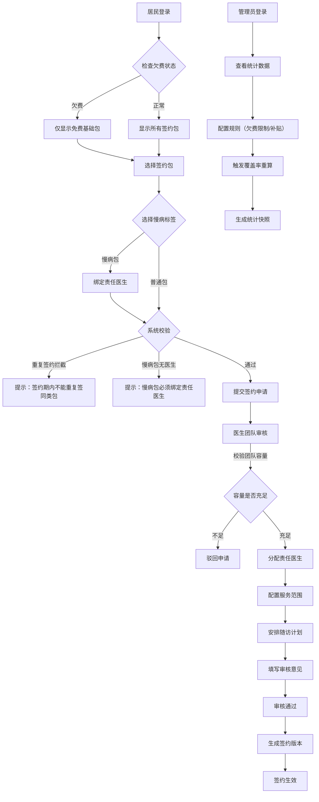

## 1. 产品概述

社区家庭医生签约全栈应用，实现居民选包、医生团队审核、卫健管理员统计的全流程数字化管理。通过明确的签约规则，让三方角色都能"说得清"，提升签约服务透明度和管理效率。

- 解决社区家庭医生签约过程中规则不透明、流程不可追溯、统计口径不一致的问题
- 目标用户包括社区居民、家庭医生团队、卫健管理部门
- 实现签约全生命周期管理，支持重复签约拦截、慢病包绑定、欠费限制等核心规则

## 2. 核心功能

### 2.1 用户角色

| 角色 | 登录方式 | 核心权限 |
|------|----------|----------|
| 社区居民 | 身份证号+手机号 | 选择签约包、查看签约状态、提交续约意向、查看服务记录 |
| 医生团队 | 工号登录 | 审核签约申请、管理团队容量、安排上门随访、查看责任居民 |
| 卫健管理员 | 管理员账号 | 查看签约覆盖率、管理补贴额度、配置欠费限制、重算统计数据 |

### 2.2 功能模块

1. **居民选包页面**: 免费/付费签约包选择、慢病标签设置、续约意向提交、欠费限制提示
2. **医生团队审核页面**: 签约申请审核、责任医生分配、团队容量管理、服务范围配置、上门随访安排
3. **管理员统计页面**: 签约覆盖率统计、补贴额度管理、欠费限制配置、统计口径说明、数据重算
4. **续约提醒页面**: 到期提醒、续约流程、审批记录查看
5. **服务台账页面**: 服务记录查询、随访安排、转诊记录
6. **转团队审批页面**: 转团队申请、审批流程、历史记录
7. **规则解释页面**: 签约规则说明、常见问题解答

### 2.3 页面详情

| 页面名称 | 模块名称 | 功能描述 |
|---------|----------|----------|
| 居民选包 | 签约包选择 | 展示免费基础包和付费增值包，支持慢病标签绑定，欠费居民自动限制可选范围 |
| 居民选包 | 签约确认 | 签约期内重复签约拦截、慢病包无责任医生拦截、签约信息确认 |
| 医生团队审核 | 申请列表 | 待审核签约申请列表，展示居民信息、选择包类型、慢病标签 |
| 医生团队审核 | 团队管理 | 团队容量配置、责任医生分配、服务范围设置 |
| 医生团队审核 | 随访安排 | 上门随访计划制定、随访记录管理 |
| 管理员统计 | 数据概览 | 签约覆盖率、各包类型占比、补贴发放统计 |
| 管理员统计 | 规则配置 | 欠费限制额度设置、补贴标准配置、统计口径管理 |
| 管理员统计 | 数据重算 | 覆盖率重算、历史数据回溯、统计快照生成 |
| 续约提醒 | 到期提醒 | 签约到期预警、续约意向收集 |
| 续约提醒 | 续约流程 | 续约申请提交、审批过程追溯 |
| 服务台账 | 服务记录 | 签约服务明细查询、随访执行记录 |
| 服务台账 | 转诊记录 | 转诊申请、转诊结果追踪 |
| 转团队审批 | 申请管理 | 转团队申请提交、原因说明 |
| 转团队审批 | 审批流程 | 转出/转入团队审核、审批意见留痕 |
| 规则解释 | 规则说明 | 签约规则详解、各角色权限说明 |
| 规则解释 | 常见问题 | FAQ展示、规则变更历史 |

## 3. 核心流程

### 3.1 居民签约流程

居民登录 → 查看欠费状态（欠费则仅可选择免费基础包）→ 选择签约包 → 选择慢病标签（慢病包需绑定责任医生）→ 系统校验（签约期内是否重复签同类包、慢病包是否有责任医生）→ 提交签约申请 → 医生团队审核 → 审核通过生成签约版本 → 生效

### 3.2 医生审核流程

医生团队登录 → 查看待审核申请 → 校验团队容量 → 分配责任医生 → 配置服务范围 → 安排上门随访计划 → 填写审核意见 → 审核通过/驳回 → 通知居民

### 3.3 管理员统计流程

管理员登录 → 查看签约覆盖率 → 配置补贴额度 → 设置欠费限制规则 → 触发统计重算 → 生成统计快照 → 导出报表

### 3.4 Mermaid 流程图

## 4. 用户界面设计

### 4.1 设计风格

- **主色调**: 医疗健康蓝 (#165DFF)，代表专业、信任、健康
- **辅助色**: 健康绿 (#00B42A) 表示通过/正常，警示橙 (#FF7D00) 表示警告，危险红 (#F53F3F) 表示错误/拦截
- **中性色**: 深灰 (#1D2129)、中灰 (#4E5969)、浅灰 (#C9CDD4)、背景灰 (#F2F3F5)
- **按钮风格**: 圆角8px，主按钮实心填充，次按钮边框描边，悬停状态有轻微阴影和颜色变化
- **字体**: 标题使用 Noto Sans SC Bold，正文使用 Noto Sans SC Regular，数字使用 Inter 等宽字体
- **布局风格**: 卡片式布局，顶部导航栏+左侧角色切换+主内容区，信息分组清晰
- **图标风格**: 使用 lucide-react 线性图标，统一20px尺寸，与文字对齐

### 4.2 页面设计概述

| 页面名称 | 模块名称 | UI 元素 |
|---------|----------|---------|
| 居民选包 | 签约包卡片 | 卡片式展示，主色边框突出选中状态，价格/服务内容清晰对比，禁用状态半透明 |
| 居民选包 | 规则拦截弹窗 | 红色标题+图标，详细说明拦截原因，提供下一步操作指引 |
| 医生团队审核 | 申请列表 | 表格展示，标签区分状态，批量操作按钮，进度条显示团队容量 |
| 医生团队审核 | 随访安排 | 日历组件展示随访计划，拖拽调整时间，颜色区分完成/待执行状态 |
| 管理员统计 | 数据概览 | 大数字卡片展示关键指标，图表展示趋势，颜色编码区分不同包类型 |
| 管理员统计 | 规则配置 | 表单分组，滑块组件设置额度，开关组件启用/禁用规则 |
| 续约提醒 | 到期提醒 | 倒计时卡片，红色高亮即将到期，一键发起续约 |
| 服务台账 | 记录列表 | 时间轴展示服务历史，标签区分服务类型，支持筛选导出 |
| 转团队审批 | 审批流程 | 步骤条展示审批进度，每步显示审批人和意见，可追溯 |
| 规则解释 | 规则说明 | 折叠面板分组展示，流程图辅助说明，搜索功能快速定位 |

### 4.3 响应式设计

- 桌面端优先设计，自适应 1280px 及以上分辨率
- 平板端（768px-1279px）：左侧导航收起为图标模式，表格支持横向滚动
- 移动端（<768px）：顶部导航折叠为汉堡菜单，卡片改为单列布局，关键操作按钮悬浮固定
- 触摸优化：按钮最小尺寸 44x44px，表单元素间距 16px 以上，支持下拉刷新和上滑加载

### 4.4 交互动效

- 页面加载：骨架屏占位，内容渐入显示（opacity 0→1，duration 300ms）
- 卡片悬停：向上偏移 2px + 阴影加深（box-shadow 0 4px 12px rgba(22,93,255,0.15)）
- 按钮点击：缩放 0.98 + 背景色加深，duration 100ms
- 表单校验错误：抖动动画（translateX -5px → 5px → 0）+ 红色边框
- 规则拦截：弹窗从底部滑入（translateY 100% → 0）+ 背景模糊
- 统计图表：数据加载时柱状图从底部生长（height 0 → 目标值），duration 600ms
- 步骤条：当前步骤高亮脉冲动画（box-shadow 0 0 0 4px rgba(22,93,255,0.2)）
