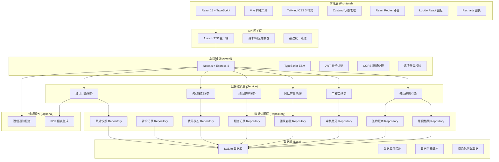
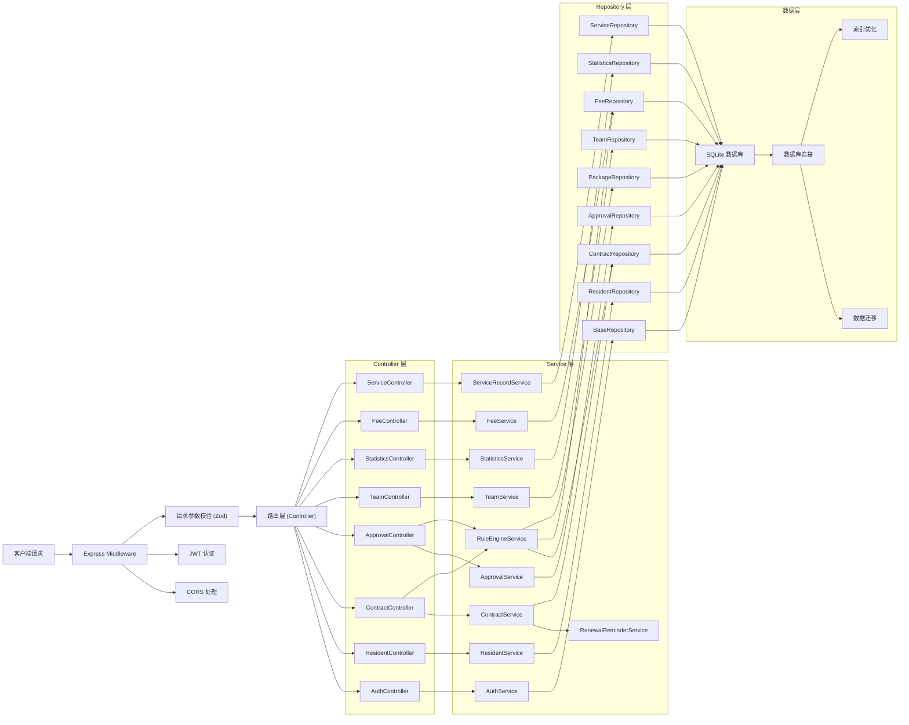
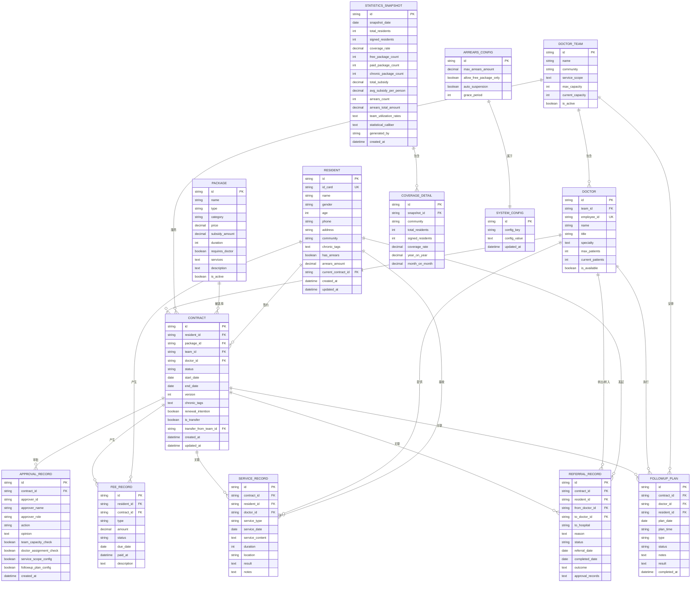

## 1. 架构设计



## 2. 技术描述

- **前端**: React@18 + TypeScript + Vite@5 + Tailwind CSS@3 + Zustand@4 + React Router@6 + Lucide React@0.344 + Recharts@2
- **前端初始化工具**: vite-init
- **后端**: Node.js@18 + Express@4 + TypeScript + JWT@9 + better-sqlite3@9
- **数据库**: SQLite（文件型数据库，便于容器化部署和演示）
- **HTTP 客户端**: Axios@1
- **参数校验**: zod@3
- **密码加密**: bcryptjs@2
- **日期处理**: dayjs@1

## 3. 路由定义

| 路由路径 | 页面名称 | 访问角色 | 功能说明 |
|---------|----------|----------|----------|
| `/login` | 登录页 | 所有 | 角色选择、身份验证 |
| `/resident/packages` | 居民选包 | 居民 | 签约包选择、慢病标签设置 |
| `/resident/my-contract` | 我的签约 | 居民 | 查看签约状态、服务记录 |
| `/resident/renewal` | 续约申请 | 居民 | 续约意向提交、审批记录 |
| `/resident/transfer` | 转团队申请 | 居民 | 转团队申请提交 |
| `/doctor/approvals` | 签约审核 | 医生团队 | 待审核申请列表、审核操作 |
| `/doctor/team` | 团队管理 | 医生团队 | 团队容量、责任医生分配 |
| `/doctor/followup` | 随访安排 | 医生团队 | 上门随访计划、服务记录 |
| `/doctor/residents` | 责任居民 | 医生团队 | 责任居民列表、健康档案 |
| `/admin/dashboard` | 数据概览 | 管理员 | 覆盖率统计、数据图表 |
| `/admin/rules` | 规则配置 | 管理员 | 欠费限制、补贴额度配置 |
| `/admin/statistics` | 统计管理 | 管理员 | 数据重算、统计快照管理 |
| `/admin/snapshot` | 快照管理 | 管理员 | 历史快照查看、导出 |
| `/service/ledger` | 服务台账 | 所有 | 服务记录查询、随访执行 |
| `/service/referral` | 转诊记录 | 所有 | 转诊申请、转诊追踪 |
| `/rules/explain` | 规则解释 | 所有 | 签约规则说明、FAQ |
| `/demo` | 演示中心 | 管理员 | 规则拦截演示、测试场景 |

## 4. API 定义

### 4.1 认证接口

```typescript
// 登录请求
interface LoginRequest {
  role: 'resident' | 'doctor' | 'admin';
  idCard?: string;        // 居民：身份证号
  phone?: string;         // 居民：手机号
  employeeId?: string;    // 医生：工号
  username?: string;      // 管理员：用户名
  password: string;
}

// 登录响应
interface LoginResponse {
  token: string;
  user: {
    id: string;
    role: string;
    name: string;
    [key: string]: any;
  };
}

// POST /api/auth/login
// POST /api/auth/logout
// GET  /api/auth/me
```

### 4.2 居民档案接口

```typescript
interface Resident {
  id: string;
  idCard: string;
  name: string;
  gender: 'male' | 'female';
  age: number;
  phone: string;
  address: string;
  community: string;
  chronicTags: string[];      // 慢病标签
  hasArrears: boolean;        // 是否欠费
  arrearsAmount: number;      // 欠费金额
  currentContractId?: string; // 当前签约ID
  createdAt: string;
  updatedAt: string;
}

// GET    /api/residents/:id
// PUT    /api/residents/:id
// GET    /api/residents/:id/contracts
// POST   /api/residents/:id/chronic-tags
```

### 4.3 签约包接口

```typescript
interface Package {
  id: string;
  name: string;
  type: 'free' | 'paid';              // 免费/付费
  category: 'basic' | 'chronic';      // 基础包/慢病包
  price: number;
  subsidyAmount: number;              // 补贴额度
  duration: number;                   // 签约周期（月）
  requiresDoctor: boolean;            // 是否需要绑定医生
  services: string[];                 // 包含服务
  description: string;
  isActive: boolean;
}

interface Contract {
  id: string;
  residentId: string;
  packageId: string;
  package: Package;
  teamId: string;
  doctorId?: string;                  // 责任医生
  status: 'pending' | 'approved' | 'rejected' | 'active' | 'expired' | 'terminated';
  startDate: string;
  endDate: string;
  version: number;                    // 签约版本
  chronicTags: string[];
  renewalIntention: boolean;          // 续约意向
  isTransfer: boolean;                // 是否转团队
  transferFromTeamId?: string;
  createdAt: string;
  updatedAt: string;
}

// GET    /api/packages
// GET    /api/packages/:id
// POST   /api/contracts              // 提交签约申请
// GET    /api/contracts/:id
// GET    /api/contracts/resident/:residentId
// POST   /api/contracts/:id/renewal  // 续约申请
// POST   /api/contracts/:id/transfer // 转团队申请
// GET    /api/contracts/validate     // 签约规则校验
```

### 4.4 审核接口

```typescript
interface ApprovalRecord {
  id: string;
  contractId: string;
  approverId: string;
  approverName: string;
  approverRole: string;
  action: 'approve' | 'reject' | 'transfer';
  opinion: string;
  teamCapacityCheck: boolean;
  doctorAssignmentCheck: boolean;
  serviceScopeConfig: boolean;
  followupPlanConfig: boolean;
  createdAt: string;
}

// GET    /api/approvals/pending       // 待审核列表
// POST   /api/approvals/:id/approve   // 审核通过
// POST   /api/approvals/:id/reject    // 审核驳回
// GET    /api/approvals/contract/:contractId  // 审批历史
```

### 4.5 医生团队接口

```typescript
interface DoctorTeam {
  id: string;
  name: string;
  community: string;
  serviceScope: string[];             // 服务范围（小区/街道）
  maxCapacity: number;                // 最大容量
  currentCapacity: number;            // 当前签约数
  isActive: boolean;
}

interface Doctor {
  id: string;
  teamId: string;
  employeeId: string;
  name: string;
  title: string;
  specialty: string[];                // 专长
  maxPatients: number;                // 最大服务居民数
  currentPatients: number;            // 当前服务居民数
  isAvailable: boolean;
}

interface FollowupPlan {
  id: string;
  contractId: string;
  doctorId: string;
  residentId: string;
  planDate: string;
  planTime: string;
  type: 'home' | 'clinic' | 'phone';
  status: 'scheduled' | 'completed' | 'cancelled';
  notes: string;
  result?: string;
  completedAt?: string;
}

// GET    /api/teams
// GET    /api/teams/:id
// PUT    /api/teams/:id/capacity     // 更新团队容量
// GET    /api/teams/:id/doctors
// GET    /api/doctors
// GET    /api/doctors/:id/patients
// GET    /api/followups
// POST   /api/followups              // 创建随访计划
// PUT    /api/followups/:id          // 更新随访状态
```

### 4.6 费用与欠费接口

```typescript
interface FeeRecord {
  id: string;
  residentId: string;
  contractId?: string;
  type: 'subscription' | 'service' | 'refund' | 'subsidy';
  amount: number;
  status: 'pending' | 'paid' | 'overdue' | 'waived';
  dueDate: string;
  paidAt?: string;
  description: string;
}

interface ArrearsConfig {
  id: string;
  maxArrearsAmount: number;           // 最大欠费额度
  allowFreePackageOnly: boolean;      // 欠费仅允许免费包
  autoSuspension: boolean;            // 自动暂停服务
  gracePeriod: number;                // 宽限期（天）
}

// GET    /api/fees/resident/:residentId
// POST   /api/fees/:id/pay
// GET    /api/config/arrears
// PUT    /api/config/arrears
```

### 4.7 统计接口

```typescript
interface StatisticsSnapshot {
  id: string;
  snapshotDate: string;
  totalResidents: number;
  signedResidents: number;
  coverageRate: number;               // 覆盖率
  freePackageCount: number;
  paidPackageCount: number;
  chronicPackageCount: number;
  totalSubsidy: number;
  avgSubsidyPerPerson: number;
  arrearsCount: number;
  arrearsTotalAmount: number;
  teamUtilizationRates: {
    teamId: string;
    teamName: string;
    utilizationRate: number;
  }[];
  statisticalCaliber: string;         // 统计口径说明
  generatedBy: string;
  createdAt: string;
}

interface CoverageDetail {
  community: string;
  totalResidents: number;
  signedResidents: number;
  coverageRate: number;
  yearOnYear: number;                 // 同比
  monthOnMonth: number;               // 环比
}

// GET    /api/statistics/overview
// GET    /api/statistics/coverage
// POST   /api/statistics/recalculate  // 触发重算
// GET    /api/statistics/snapshots
// GET    /api/statistics/snapshots/:id
// POST   /api/statistics/snapshots    // 生成快照
// GET    /api/statistics/caliber      // 统计口径说明
// PUT    /api/statistics/caliber
```

### 4.8 服务记录与转诊接口

```typescript
interface ServiceRecord {
  id: string;
  contractId: string;
  residentId: string;
  doctorId: string;
  serviceType: string;
  serviceDate: string;
  serviceContent: string;
  duration: number;                   // 分钟
  location: string;
  result: string;
  notes: string;
}

interface ReferralRecord {
  id: string;
  contractId: string;
  residentId: string;
  fromDoctorId: string;
  toDoctorId?: string;
  toHospital?: string;
  reason: string;
  status: 'pending' | 'accepted' | 'completed' | 'rejected';
  referralDate: string;
  completedDate?: string;
  outcome?: string;
  approvalRecords: {
    approverId: string;
    approverName: string;
    action: string;
    opinion: string;
    createdAt: string;
  }[];
}

// GET    /api/services
// POST   /api/services
// GET    /api/services/contract/:contractId
// GET    /api/referrals
// POST   /api/referrals
// PUT    /api/referrals/:id/status
```

## 5. 服务器架构图



## 6. 数据模型

### 6.1 ER 图



### 6.2 DDL 语句

```sql
-- 居民档案表
CREATE TABLE resident (
    id TEXT PRIMARY KEY,
    id_card TEXT UNIQUE NOT NULL,
    name TEXT NOT NULL,
    gender TEXT CHECK(gender IN ('male', 'female')) NOT NULL,
    age INTEGER NOT NULL,
    phone TEXT NOT NULL,
    address TEXT,
    community TEXT NOT NULL,
    chronic_tags TEXT DEFAULT '[]',
    has_arrears INTEGER DEFAULT 0,
    arrears_amount REAL DEFAULT 0,
    current_contract_id TEXT,
    created_at TEXT DEFAULT CURRENT_TIMESTAMP,
    updated_at TEXT DEFAULT CURRENT_TIMESTAMP,
    FOREIGN KEY(current_contract_id) REFERENCES contract(id)
);

CREATE INDEX idx_resident_community ON resident(community);
CREATE INDEX idx_resident_has_arrears ON resident(has_arrears);

-- 签约包表
CREATE TABLE package (
    id TEXT PRIMARY KEY,
    name TEXT NOT NULL,
    type TEXT CHECK(type IN ('free', 'paid')) NOT NULL,
    category TEXT CHECK(category IN ('basic', 'chronic')) NOT NULL,
    price REAL DEFAULT 0,
    subsidy_amount REAL DEFAULT 0,
    duration INTEGER NOT NULL,
    requires_doctor INTEGER DEFAULT 0,
    services TEXT DEFAULT '[]',
    description TEXT,
    is_active INTEGER DEFAULT 1
);

-- 医生团队表
CREATE TABLE doctor_team (
    id TEXT PRIMARY KEY,
    name TEXT NOT NULL,
    community TEXT NOT NULL,
    service_scope TEXT DEFAULT '[]',
    max_capacity INTEGER NOT NULL,
    current_capacity INTEGER DEFAULT 0,
    is_active INTEGER DEFAULT 1
);

CREATE INDEX idx_team_community ON doctor_team(community);

-- 医生表
CREATE TABLE doctor (
    id TEXT PRIMARY KEY,
    team_id TEXT NOT NULL,
    employee_id TEXT UNIQUE NOT NULL,
    name TEXT NOT NULL,
    title TEXT NOT NULL,
    specialty TEXT DEFAULT '[]',
    max_patients INTEGER NOT NULL,
    current_patients INTEGER DEFAULT 0,
    is_available INTEGER DEFAULT 1,
    FOREIGN KEY(team_id) REFERENCES doctor_team(id)
);

CREATE INDEX idx_doctor_team ON doctor(team_id);
CREATE INDEX idx_doctor_available ON doctor(is_available);

-- 签约表
CREATE TABLE contract (
    id TEXT PRIMARY KEY,
    resident_id TEXT NOT NULL,
    package_id TEXT NOT NULL,
    team_id TEXT NOT NULL,
    doctor_id TEXT,
    status TEXT CHECK(status IN ('pending', 'approved', 'rejected', 'active', 'expired', 'terminated')) NOT NULL,
    start_date TEXT NOT NULL,
    end_date TEXT NOT NULL,
    version INTEGER DEFAULT 1,
    chronic_tags TEXT DEFAULT '[]',
    renewal_intention INTEGER DEFAULT 0,
    is_transfer INTEGER DEFAULT 0,
    transfer_from_team_id TEXT,
    created_at TEXT DEFAULT CURRENT_TIMESTAMP,
    updated_at TEXT DEFAULT CURRENT_TIMESTAMP,
    FOREIGN KEY(resident_id) REFERENCES resident(id),
    FOREIGN KEY(package_id) REFERENCES package(id),
    FOREIGN KEY(team_id) REFERENCES doctor_team(id),
    FOREIGN KEY(doctor_id) REFERENCES doctor(id)
);

CREATE INDEX idx_contract_resident ON contract(resident_id);
CREATE INDEX idx_contract_status ON contract(status);
CREATE INDEX idx_contract_team ON contract(team_id);
CREATE INDEX idx_contract_doctor ON contract(doctor_id);
CREATE INDEX idx_contract_dates ON contract(start_date, end_date);

-- 审核意见表
CREATE TABLE approval_record (
    id TEXT PRIMARY KEY,
    contract_id TEXT NOT NULL,
    approver_id TEXT NOT NULL,
    approver_name TEXT NOT NULL,
    approver_role TEXT NOT NULL,
    action TEXT CHECK(action IN ('approve', 'reject', 'transfer')) NOT NULL,
    opinion TEXT,
    team_capacity_check INTEGER DEFAULT 0,
    doctor_assignment_check INTEGER DEFAULT 0,
    service_scope_config INTEGER DEFAULT 0,
    followup_plan_config INTEGER DEFAULT 0,
    created_at TEXT DEFAULT CURRENT_TIMESTAMP,
    FOREIGN KEY(contract_id) REFERENCES contract(id)
);

CREATE INDEX idx_approval_contract ON approval_record(contract_id);

-- 随访计划表
CREATE TABLE followup_plan (
    id TEXT PRIMARY KEY,
    contract_id TEXT NOT NULL,
    doctor_id TEXT NOT NULL,
    resident_id TEXT NOT NULL,
    plan_date TEXT NOT NULL,
    plan_time TEXT NOT NULL,
    type TEXT CHECK(type IN ('home', 'clinic', 'phone')) NOT NULL,
    status TEXT CHECK(status IN ('scheduled', 'completed', 'cancelled')) NOT NULL,
    notes TEXT,
    result TEXT,
    completed_at TEXT,
    FOREIGN KEY(contract_id) REFERENCES contract(id),
    FOREIGN KEY(doctor_id) REFERENCES doctor(id),
    FOREIGN KEY(resident_id) REFERENCES resident(id)
);

CREATE INDEX idx_followup_date ON followup_plan(plan_date);
CREATE INDEX idx_followup_status ON followup_plan(status);
CREATE INDEX idx_followup_doctor ON followup_plan(doctor_id);

-- 服务记录表
CREATE TABLE service_record (
    id TEXT PRIMARY KEY,
    contract_id TEXT NOT NULL,
    resident_id TEXT NOT NULL,
    doctor_id TEXT NOT NULL,
    service_type TEXT NOT NULL,
    service_date TEXT NOT NULL,
    service_content TEXT NOT NULL,
    duration INTEGER,
    location TEXT,
    result TEXT,
    notes TEXT,
    FOREIGN KEY(contract_id) REFERENCES contract(id),
    FOREIGN KEY(resident_id) REFERENCES resident(id),
    FOREIGN KEY(doctor_id) REFERENCES doctor(id)
);

CREATE INDEX idx_service_date ON service_record(service_date);
CREATE INDEX idx_service_resident ON service_record(resident_id);

-- 转诊记录表
CREATE TABLE referral_record (
    id TEXT PRIMARY KEY,
    contract_id TEXT NOT NULL,
    resident_id TEXT NOT NULL,
    from_doctor_id TEXT NOT NULL,
    to_doctor_id TEXT,
    to_hospital TEXT,
    reason TEXT NOT NULL,
    status TEXT CHECK(status IN ('pending', 'accepted', 'completed', 'rejected')) NOT NULL,
    referral_date TEXT NOT NULL,
    completed_date TEXT,
    outcome TEXT,
    approval_records TEXT DEFAULT '[]',
    FOREIGN KEY(contract_id) REFERENCES contract(id),
    FOREIGN KEY(resident_id) REFERENCES resident(id),
    FOREIGN KEY(from_doctor_id) REFERENCES doctor(id),
    FOREIGN KEY(to_doctor_id) REFERENCES doctor(id)
);

CREATE INDEX idx_referral_status ON referral_record(status);
CREATE INDEX idx_referral_date ON referral_record(referral_date);

-- 费用状态表
CREATE TABLE fee_record (
    id TEXT PRIMARY KEY,
    resident_id TEXT NOT NULL,
    contract_id TEXT,
    type TEXT CHECK(type IN ('subscription', 'service', 'refund', 'subsidy')) NOT NULL,
    amount REAL NOT NULL,
    status TEXT CHECK(status IN ('pending', 'paid', 'overdue', 'waived')) NOT NULL,
    due_date TEXT NOT NULL,
    paid_at TEXT,
    description TEXT,
    FOREIGN KEY(resident_id) REFERENCES resident(id),
    FOREIGN KEY(contract_id) REFERENCES contract(id)
);

CREATE INDEX idx_fee_resident ON fee_record(resident_id);
CREATE INDEX idx_fee_status ON fee_record(status);
CREATE INDEX idx_fee_due_date ON fee_record(due_date);

-- 统计快照表
CREATE TABLE statistics_snapshot (
    id TEXT PRIMARY KEY,
    snapshot_date TEXT NOT NULL,
    total_residents INTEGER NOT NULL,
    signed_residents INTEGER NOT NULL,
    coverage_rate REAL NOT NULL,
    free_package_count INTEGER DEFAULT 0,
    paid_package_count INTEGER DEFAULT 0,
    chronic_package_count INTEGER DEFAULT 0,
    total_subsidy REAL DEFAULT 0,
    avg_subsidy_per_person REAL DEFAULT 0,
    arrears_count INTEGER DEFAULT 0,
    arrears_total_amount REAL DEFAULT 0,
    team_utilization_rates TEXT DEFAULT '[]',
    statistical_caliber TEXT,
    generated_by TEXT NOT NULL,
    created_at TEXT DEFAULT CURRENT_TIMESTAMP
);

CREATE INDEX idx_snapshot_date ON statistics_snapshot(snapshot_date);

-- 覆盖率明细表
CREATE TABLE coverage_detail (
    id TEXT PRIMARY KEY,
    snapshot_id TEXT NOT NULL,
    community TEXT NOT NULL,
    total_residents INTEGER NOT NULL,
    signed_residents INTEGER NOT NULL,
    coverage_rate REAL NOT NULL,
    year_on_year REAL,
    month_on_month REAL,
    FOREIGN KEY(snapshot_id) REFERENCES statistics_snapshot(id)
);

-- 欠费配置表
CREATE TABLE arrears_config (
    id TEXT PRIMARY KEY,
    max_arrears_amount REAL DEFAULT 0,
    allow_free_package_only INTEGER DEFAULT 1,
    auto_suspension INTEGER DEFAULT 0,
    grace_period INTEGER DEFAULT 30
);

-- 系统配置表
CREATE TABLE system_config (
    id TEXT PRIMARY KEY,
    config_key TEXT UNIQUE NOT NULL,
    config_value TEXT,
    updated_at TEXT DEFAULT CURRENT_TIMESTAMP
);

-- 用户表（用于登录认证）
CREATE TABLE user (
    id TEXT PRIMARY KEY,
    username TEXT UNIQUE NOT NULL,
    password TEXT NOT NULL,
    role TEXT CHECK(role IN ('resident', 'doctor', 'admin')) NOT NULL,
    ref_id TEXT NOT NULL,
    name TEXT NOT NULL,
    is_active INTEGER DEFAULT 1,
    created_at TEXT DEFAULT CURRENT_TIMESTAMP
);

CREATE INDEX idx_user_role ON user(role);
CREATE INDEX idx_user_ref ON user(ref_id);
```

### 6.3 初始化数据

```sql
-- 初始化签约包
INSERT INTO package (id, name, type, category, price, subsidy_amount, duration, requires_doctor, services, description, is_active) VALUES
('PKG001', '免费基础包', 'free', 'basic', 0, 0, 12, 0, '["健康咨询", "体格检查", "健康档案管理"]', '为全体居民提供的基础签约服务，包含基本健康管理', 1),
('PKG002', '高血压慢病包', 'paid', 'chronic', 120, 80, 12, 1, '["血压监测", "用药指导", "饮食干预", "每月随访", "并发症筛查"]', '针对高血压患者的专项管理服务，每月定期随访', 1),
('PKG003', '糖尿病慢病包', 'paid', 'chronic', 150, 100, 12, 1, '["血糖监测", "用药指导", "饮食干预", "每月随访", "并发症筛查"]', '针对糖尿病患者的专项管理服务，每月定期随访', 1),
('PKG004', '高血压+糖尿病合并包', 'paid', 'chronic', 240, 160, 12, 1, '["血压监测", "血糖监测", "联合用药指导", "每两周随访", "并发症筛查"]', '针对高血压合并糖尿病患者的综合管理服务', 1),
('PKG005', '老年人健康包', 'paid', 'chronic', 180, 120, 12, 1, '["体格检查", "认知评估", "跌倒风险评估", "每季度随访", "疫苗接种提醒"]', '针对65岁以上老年人的专项健康管理服务', 1);

-- 初始化医生团队
INSERT INTO doctor_team (id, name, community, service_scope, max_capacity, current_capacity, is_active) VALUES
('TEAM001', '东风社区第一家庭医生团队', '东风社区', '["东风小区", "阳光花园", "幸福里"]', 500, 0, 1),
('TEAM002', '东风社区第二家庭医生团队', '东风社区', '["和平小区", "解放路1-100号", "人民路片区"]', 500, 0, 1),
('TEAM003', '胜利社区家庭医生团队', '胜利社区', '["胜利小区", "红星街", "建设路片区"]', 600, 0, 1),
('TEAM004', '新华社区家庭医生团队', '新华社区', '["新华小区", "文化路", "北京路片区"]', 400, 0, 1);

-- 初始化医生
INSERT INTO doctor (id, team_id, employee_id, name, title, specialty, max_patients, current_patients, is_available) VALUES
('DOC001', 'TEAM001', 'EMP001', '张医生', '全科主任医师', '["高血压", "糖尿病", "老年病"]', 200, 0, 1),
('DOC002', 'TEAM001', 'EMP002', '李医生', '全科主治医师', '["高血压", "心血管疾病"]', 150, 0, 1),
('DOC003', 'TEAM001', 'EMP003', '王护士', '主管护师', '["护理", "健康宣教"]', 150, 0, 1),
('DOC004', 'TEAM002', 'EMP004', '刘医生', '全科副主任医师', '["糖尿病", "内分泌疾病"]', 180, 0, 1),
('DOC005', 'TEAM002', 'EMP005', '陈医生', '全科医师', '["呼吸系统疾病", "慢性病管理"]', 120, 0, 1),
('DOC006', 'TEAM003', 'EMP006', '赵医生', '全科主任医师', '["高血压", "糖尿病", "老年病"]', 200, 0, 0),
('DOC007', 'TEAM003', 'EMP007', '孙医生', '全科主治医师', '["消化系统疾病"]', 150, 0, 1),
('DOC008', 'TEAM004', 'EMP008', '周医生', '全科副主任医师', '["心血管疾病", "高血压"]', 180, 0, 1);

-- 初始化欠费配置
INSERT INTO arrears_config (id, max_arrears_amount, allow_free_package_only, auto_suspension, grace_period) VALUES
('CFG001', 200, 1, 0, 30);

-- 初始化系统配置
INSERT INTO system_config (id, config_key, config_value) VALUES
('SYS001', 'statistical_caliber', '签约覆盖率 = 已签约居民数 / 辖区常住居民总数 × 100%。已签约居民指在统计时点有有效签约记录的居民。常住居民指在辖区居住满6个月以上的居民。'),
('SYS002', 'subsidy_standard', '慢病包补贴标准：高血压包80元/人/年，糖尿病包100元/人/年，合并包160元/人/年，老年人健康包120元/人/年。'),
('SYS003', 'renewal_reminder_days', '30');

-- 初始化测试居民
INSERT INTO resident (id, id_card, name, gender, age, phone, address, community, chronic_tags, has_arrears, arrears_amount) VALUES
('RES001', '110101198001011234', '张三', 'male', 45, '13800138001', '东风小区1号楼101', '东风社区', '[]', 0, 0),
('RES002', '110101197503152345', '李四', 'male', 50, '13800138002', '阳光花园2号楼202', '东风社区', '["高血压"]', 0, 0),
('RES003', '110101196005203456', '王五', 'female', 66, '13800138003', '幸福里3号楼303', '东风社区', '["高血压", "糖尿病"]', 1, 250),
('RES004', '110101198507104567', '赵六', 'female', 40, '13800138004', '和平小区4号楼404', '东风社区', '[]', 0, 0),
('RES005', '110101195509255678', '孙七', 'male', 70, '13800138005', '胜利小区1号楼101', '胜利社区', '["糖尿病"]', 0, 0),
('RES006', '110101199011306789', '周八', 'female', 35, '13800138006', '新华小区2号楼202', '新华社区', '[]', 1, 100);

-- 初始化测试用户（密码统一为 123456，bcrypt 加密后）
INSERT INTO user (id, username, password, role, ref_id, name) VALUES
-- 居民用户
('USR001', '110101198001011234', '$2a$10$N9qo8uLOickgx2ZMRZoMyeIjZAgcfl7p92ldGxad68LJZdL17lhWy', 'resident', 'RES001', '张三'),
('USR002', '110101197503152345', '$2a$10$N9qo8uLOickgx2ZMRZoMyeIjZAgcfl7p92ldGxad68LJZdL17lhWy', 'resident', 'RES002', '李四'),
('USR003', '110101196005203456', '$2a$10$N9qo8uLOickgx2ZMRZoMyeIjZAgcfl7p92ldGxad68LJZdL17lhWy', 'resident', 'RES003', '王五'),
('USR004', '110101198507104567', '$2a$10$N9qo8uLOickgx2ZMRZoMyeIjZAgcfl7p92ldGxad68LJZdL17lhWy', 'resident', 'RES004', '赵六'),
('USR005', '110101195509255678', '$2a$10$N9qo8uLOickgx2ZMRZoMyeIjZAgcfl7p92ldGxad68LJZdL17lhWy', 'resident', 'RES005', '孙七'),
('USR006', '110101199011306789', '$2a$10$N9qo8uLOickgx2ZMRZoMyeIjZAgcfl7p92ldGxad68LJZdL17lhWy', 'resident', 'RES006', '周八'),
-- 医生用户
('USR007', 'EMP001', '$2a$10$N9qo8uLOickgx2ZMRZoMyeIjZAgcfl7p92ldGxad68LJZdL17lhWy', 'doctor', 'DOC001', '张医生'),
('USR008', 'EMP002', '$2a$10$N9qo8uLOickgx2ZMRZoMyeIjZAgcfl7p92ldGxad68LJZdL17lhWy', 'doctor', 'DOC002', '李医生'),
('USR009', 'EMP004', '$2a$10$N9qo8uLOickgx2ZMRZoMyeIjZAgcfl7p92ldGxad68LJZdL17lhWy', 'doctor', 'DOC004', '刘医生'),
('USR010', 'EMP007', '$2a$10$N9qo8uLOickgx2ZMRZoMyeIjZAgcfl7p92ldGxad68LJZdL17lhWy', 'doctor', 'DOC007', '孙医生'),
-- 管理员用户
('USR011', 'admin', '$2a$10$N9qo8uLOickgx2ZMRZoMyeIjZAgcfl7p92ldGxad68LJZdL17lhWy', 'admin', 'ADMIN001', '系统管理员');
```
